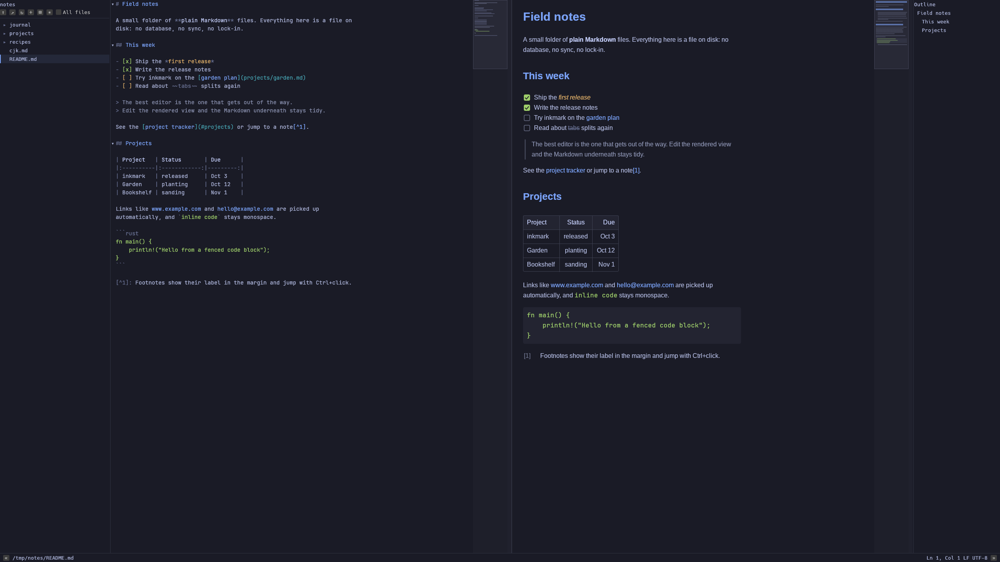
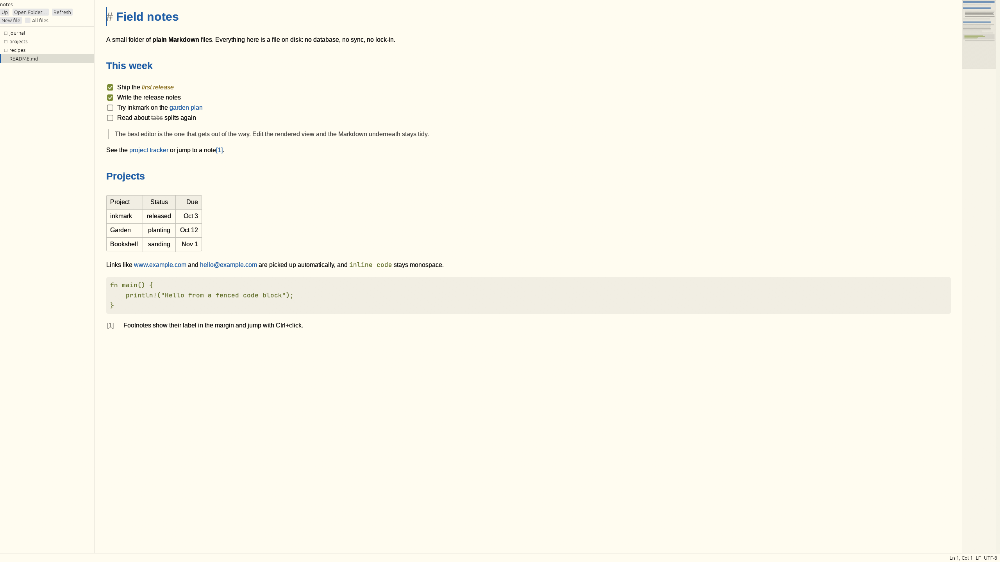
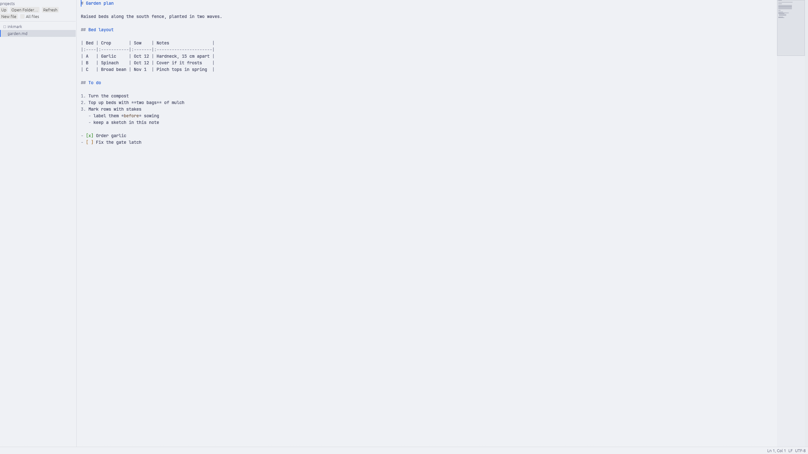
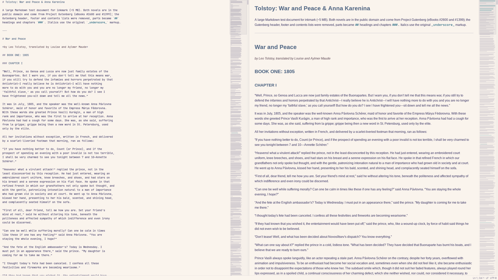
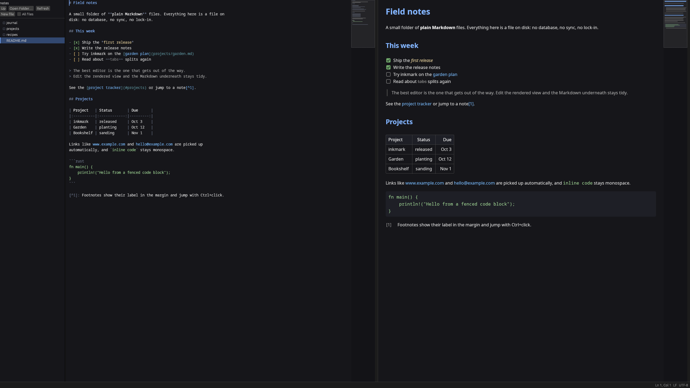

# inkmark

[](https://github.com/joshuabaran/inkmark/actions/workflows/ci.yml)

A fast, local Markdown editor for Linux and Wayland. Plain `.md` files on
disk are the only source of truth: no accounts, sync or plugins.



- **Three views of one document**: split (raw Markdown left, rendered
  right), code only, or live only. Both panes are editable; one undo history.
- **Live editing as source patches**: typing in the rendered view edits the
  Markdown at that spot and nothing else. Syntax shows around the caret
  (the element you're in, block markers on your line) and hides elsewhere.
- **Fast on big files**: rope buffer, background parsing, virtualized panes;
  responsive on 5–10 MB documents.
- **GitHub Flavored Markdown**: tables edited as a grid, task lists with
  clickable checkboxes, strikethrough, footnotes, and bare URLs and emails
  linked automatically. Parsed by [pulldown-cmark](https://github.com/pulldown-cmark/pulldown-cmark)
  and checked against every example in the CommonMark and GFM specs.
- **Per-pane minimaps**, images (PNG, JPEG, GIF, WebP, BMP, SVG), recent files.
- **Your desktop's look**: on [Omarchy](https://omarchy.org) it uses the
  current theme's colors and follows `omarchy theme set` live; elsewhere it
  picks dark or light to match the desktop. The document uses fontconfig
  (Omarchy's `omarchy font set` included) unless you choose your own.
  The sidebar, status bar, and dialogs use Hack, so the folder and unsaved
  marks render the same on every machine.
- **Folder sidebar**: browse a directory of notes; open, create, rename
  and move them (drag and drop works), or move them to the trash. Search
  the folder, and show or hide the outline.
- **Links you can follow**: Ctrl+click a link to open another note, jump
  to a heading or footnote, or open a web page; Alt+Left goes back.

<table>
<tr>
<td></td>
<td></td>
</tr>
<tr>
<td align="center">Live view · Flexoki Light</td>
<td align="center">Code view · Catppuccin Latte</td>
</tr>
<tr>
<td></td>
<td></td>
</tr>
<tr>
<td align="center">A 5 MB book with minimaps · Rosé Pine</td>
<td align="center">Built-in dark theme</td>
</tr>
</table>

The themes are Omarchy's; inkmark follows whichever one is active.

See [PLAN.md](PLAN.md) for the design, measurements and roadmap.

## Install

### From a release

Each [release](https://github.com/joshuabaran/inkmark/releases) has a
Linux x86_64 build (glibc 2.39 or newer, so current Arch, Fedora, or Ubuntu
24.04 and later). Download the `.tar.gz` and its `.sha256`, then:

```sh
sha256sum -c inkmark-*.tar.gz.sha256
tar xzf inkmark-*.tar.gz && cd inkmark-*/
install -Dm755 inkmark ~/.local/bin/inkmark
install -Dm644 inkmark.desktop ~/.local/share/applications/inkmark.desktop
install -Dm644 inkmark.svg ~/.local/share/icons/hicolor/scalable/apps/inkmark.svg
```

### Arch Linux

```sh
git clone https://github.com/joshuabaran/inkmark.git
cd inkmark/pack
makepkg -si
```

The `inkmark-git` package builds the latest commit and installs the binary,
a desktop entry (registered for Markdown files) and an icon.

### Any Linux, with Cargo

```sh
cargo build --release
install -Dm755 target/release/inkmark ~/.local/bin/inkmark
install -Dm644 pack/inkmark.desktop ~/.local/share/applications/inkmark.desktop
install -Dm644 pack/inkmark.svg ~/.local/share/icons/hicolor/scalable/apps/inkmark.svg
```

Runtime dependencies: a Wayland compositor (X11 also works), a Vulkan driver,
and `xdg-desktop-portal` for the open, save and folder dialogs (without
it, open files by passing them on the command line). Install CJK and emoji
fonts (e.g. `noto-fonts-cjk`, `noto-fonts-emoji`) to see those characters.

For machines without working Vulkan, build with `--features glow` and run
with `INKMARK_RENDERER=glow` to use OpenGL.

## Use

```sh
inkmark --help        # usage; inkmark --version prints the version
inkmark --list-keys   # the key bindings below, as config.toml
inkmark notes.md      # browses that file's folder; a missing path is a new file there
inkmark ~/notes       # browses the folder, with nothing open
inkmark               # browses the current directory and shows recent files
```

| Keys | Action |
|---|---|
| Ctrl+E | Cycle split, code, and live (`cycle_mode`) |
| Ctrl+1 | Focus the code pane (switching to it when only live shows) (`focus_code`) |
| Ctrl+2 | Focus the live pane (switching to it when only code shows) (`focus_live`) |
| Ctrl+M | Toggle the focused pane's minimap (`toggle_minimap`) |
| Ctrl+O | Open a file (`open_file`) |
| Ctrl+S | Save (`save`) |
| Ctrl+Shift+S | Save as (`save_as`) |
| Ctrl+Shift+O | Open a folder in the sidebar (`open_folder`) |
| Ctrl+Shift+E | Show or hide the sidebar (`toggle_sidebar`) |
| Ctrl+N | New Markdown file in the selected folder, or the open folder (`new_file`) |
| Ctrl+R | Recent files (`recent_files`) |
| Alt+Left | Back to where you followed the last link from (`back`) |
| Alt+Right | Forward again (`forward`) |
| F2 | Rename the selected file or folder (`rename`) |
| Delete | Move the selected file or folder to the trash (`move_to_trash`) |
| Ctrl+Z | Undo (`undo`) |
| Ctrl+Shift+Z, Ctrl+Y | Redo (`redo`) |
| Ctrl+B | Toggle bold (`bold`) |
| Ctrl+I | Toggle italic (`italic`) |
| Ctrl+Backtick | Toggle code (`code`) |
| Ctrl+Shift+X | Toggle strikethrough (`strikethrough`) |
| Ctrl+K | Insert a link (`link`) |
| Ctrl+Enter | Toggle the line's task checkbox (`toggle_task`) |
| Ctrl+Alt+0 | Turn the line into a paragraph (`heading_0`) |
| Ctrl+Alt+1 | Set heading level 1 (`heading_1`) |
| Ctrl+Alt+2 | Set heading level 2 (`heading_2`) |
| Ctrl+Alt+3 | Set heading level 3 (`heading_3`) |
| Ctrl+Alt+4 | Set heading level 4 (`heading_4`) |
| Ctrl+Alt+5 | Set heading level 5 (`heading_5`) |
| Ctrl+Alt+6 | Set heading level 6 (`heading_6`) |
| Ctrl+A | Select all (`select_all`) |
| Ctrl+Left | Move to the previous word (`word_left`) |
| Ctrl+Right | Move to the next word (`word_right`) |
| Ctrl+Backspace | Delete the previous word (`delete_word_left`) |
| Ctrl+Delete | Delete the next word (`delete_word_right`) |
| Ctrl+Home | Move to the start of the document (`document_start`) |
| Ctrl+End | Move to the end of the document (`document_end`) |
| Ctrl+Alt+Up | Insert a table row above (`insert_row_above`) |
| Ctrl+Alt+Down | Insert a table row below (`insert_row_below`) |
| Ctrl+Alt+Left | Insert a table column to the left (`insert_column_left`) |
| Ctrl+Alt+Right | Insert a table column to the right (`insert_column_right`) |
| Ctrl+Alt+Backspace | Delete the table row (`delete_row`) |
| Ctrl+Alt+Shift+Backspace | Delete the table column (`delete_column`) |
| Alt+Shift+Up | Move the table row up (`move_row_up`) |
| Alt+Shift+Down | Move the table row down (`move_row_down`) |
| Alt+Shift+Left | Move the table column left (`move_column_left`) |
| Alt+Shift+Right | Move the table column right (`move_column_right`) |
| Ctrl+Alt+F | Line up the table's pipes (`format_table`) |
| Ctrl+Alt+T | Insert a 3×3 table (`insert_table`) |
| Ctrl+F | Find in this file (`find`) |
| Ctrl+H | Replace in this file (`replace`) |
| F3 | Find the next match (`find_next`) |
| Shift+F3 | Find the previous match (`find_previous`) |
| Ctrl+G | Go to line (`go_to_line`) |
| Ctrl+D | Select word (`select_word`) |
| Ctrl+Shift+P | Select paragraph (`select_paragraph`) |
| Ctrl+Shift+Backslash | Jump to the matching fence or brackets (`match_bracket`) |
| Ctrl+Shift+F | Search the open folder (`search_folder`) |
| Ctrl+Shift+B | Show or hide the outline (`toggle_outline`) |
| Ctrl+Shift+N | New folder in the selected folder, or the open folder (`new_folder`) |
| F1 | Show or hide the key bindings (`show_keys`) |

Arrows, Home, End, Page Up, Page Down, Backspace, Delete, Enter and Tab edit
as usual, and holding Shift extends a selection. Those keys are not in the
table, so they can't be rebound; the Ctrl and Alt chords of them can, and
are listed above. Ctrl+click follows a link (a note, `#heading`, footnote,
or web page) and is not a binding either. In the live pane, Enter continues
a list item or quote and leaves an empty one; Shift+Enter inserts a hard
line break. In a table, Tab and Shift+Tab move to the next and previous
cell, and Enter moves to the cell below, adding a row on the last. Outside
a table, a table chord keeps its ordinary meaning, so Alt+Shift+Left still
extends the selection.

In the live pane, click a task's checkbox to tick it. Right-click a table cell for the
row, column and alignment commands. When you leave a table you edited,
its columns are padded so the pipes line up again (one undo step).
`$...$` and `$$...$$` are drawn as formulas there. The source stays as
written, and a caret in the formula shows those bytes.

The sidebar sits to the left of the panes. Its buttons are ↑ up to the
parent folder, ↗ to open a folder, ↻ to re-read the folders that are
expanded, + for a new note, ⊞ for a new folder, and ∗ to search. Each one
has a tooltip, and All files stays words. Arrow keys move through the
tree, Left and Right collapse and expand a folder, and Enter opens a
Markdown file. Ctrl+Shift+F searches this folder, and so does ∗. A file
name is listed first, and a match inside a file follows; opening either
one opens that note. A name without a Markdown extension gets `.md`. A
new folder keeps the name you type. Right-click an entry to rename it,
move it (or drag it onto a folder), move it to the trash, or create a
file or a folder next to it. Nothing is ever overwritten: a name that's
taken is refused. If the open file is renamed or moved, it stays open
with your unsaved edits. The sidebar's width, and whether it is showing,
are remembered under `$XDG_STATE_HOME/inkmark`, with the editor layout:
which of the code and live panes are open, each pane's minimap, the split
between them, the outline's width, and whether the outline is showing.
« and » at the edges of the status bar show or hide the sidebar and the
outline. Drag the lines between the sidebar, the panes, and the outline
to set those widths. F1 lists the keys in effect.

### Settings

inkmark reads `~/.config/inkmark/config.toml` (or `$XDG_CONFIG_HOME/inkmark`)
and applies changes to it while running:

```toml
[font]
code = "JetBrains Mono"   # code pane and code spans; default: the system monospace font
text = "Inter"            # live pane; default: the system sans-serif font
                          # neither changes the sidebar or the other chrome
code_size = 14            # points
text_size = 16

[keys]
bold = "Ctrl+Shift+L"     # one chord, or a list of them
italic = []               # an empty list unbinds; anything left out keeps its default
```

`inkmark --list-keys` prints every binding as it stands, ready to paste
into that table. A name inkmark doesn't know, a chord it can't read, a
typing key with no Ctrl, Alt, or Super (it would also insert the
character), or two actions on one chord is reported, and that one keeps
its default; the rest of the file still applies. Super, Ctrl+Alt+Delete,
and Alt+Tab (with or without Shift or Ctrl) belong to the desktop: binding
one is kept, and the error banner says the desktop will take it.

Colors come from the desktop: Omarchy's current theme if there is one,
otherwise inkmark's own dark or light theme. `INKMARK_THEME=path/to/colors.toml`
uses an Omarchy-style palette file instead.

Ctrl+click follows a link in either pane. Links to other Markdown files
(relative to the open file) open them, through the usual unsaved-changes
prompt; `#heading` jumps by GitHub's anchor rules; a footnote reference
jumps to its note; `http`, `https` and `mailto` links open in your
default app, and so do links to images, PDFs, plain text, audio, video
and office documents. Anything else (scripts, `.desktop` files, any file
marked executable) isn't opened; the status bar says why.

inkmark keeps your line endings (LF/CRLF) and byte-order mark, saves
atomically, and never overwrites changes made by other programs without
asking: if the open file changes on disk, a banner offers **Reload** or
**Keep mine**; if it's deleted, your text stays and saving recreates it.
Opening another file or closing with unsaved changes asks first.

## Develop

```sh
cargo test --workspace                                  # unit, spec, fuzz tests
cargo test --release --workspace -- --ignored --nocapture   # benchmarks
scripts/measure.sh [big.md]                             # startup, memory, scroll fps
FUZZ_ITERS=5000 cargo test --release -p inkmark-view --test live_edit fuzzed
```

CI (`.github/workflows/ci.yml`) runs formatting, clippy (also with the
`glow` renderer), rustdoc, the tests, a release build, and coverage with
[cargo-llvm-cov](https://github.com/taiki-e/cargo-llvm-cov). The coverage
summary is on each run's page, with the HTML report and `lcov.info` as an
artifact. Locally:

```sh
cargo install cargo-llvm-cov && rustup component add llvm-tools-preview
cargo llvm-cov --workspace --open
```

The workspace is split into `inkmark-buffer` (rope, edits, undo, file I/O),
`inkmark-parse` (parser seam, block tree, source map), `inkmark-text`
(cosmic-text layout and glyph atlas), `inkmark-view` (code and live panes,
and the folder sidebar), `inkmark-files` (folder tree, listing and
watching), `inkmark-minimap`, and the `inkmark` app. Large test documents
are not in the repo; `scripts/measure.sh` takes any big `.md` file.

## License

Licensed under either of [Apache License 2.0](LICENSE-APACHE) or
[MIT](LICENSE-MIT), at your option. The CommonMark and GFM spec examples
in `fixtures/` are CC-BY-SA 4.0 (see the README in each folder).
